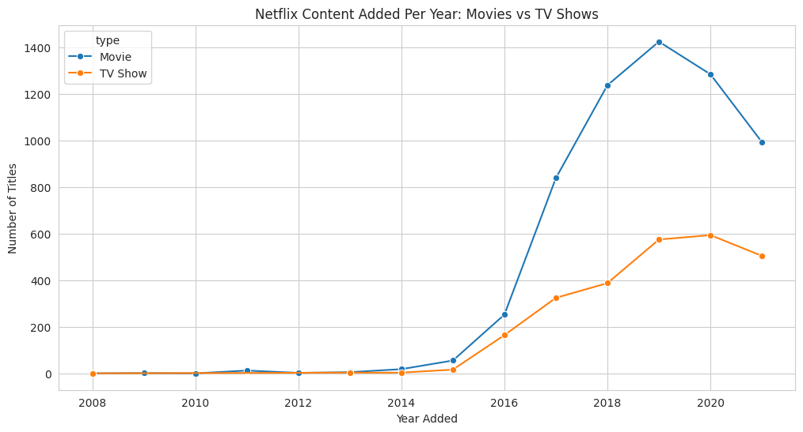
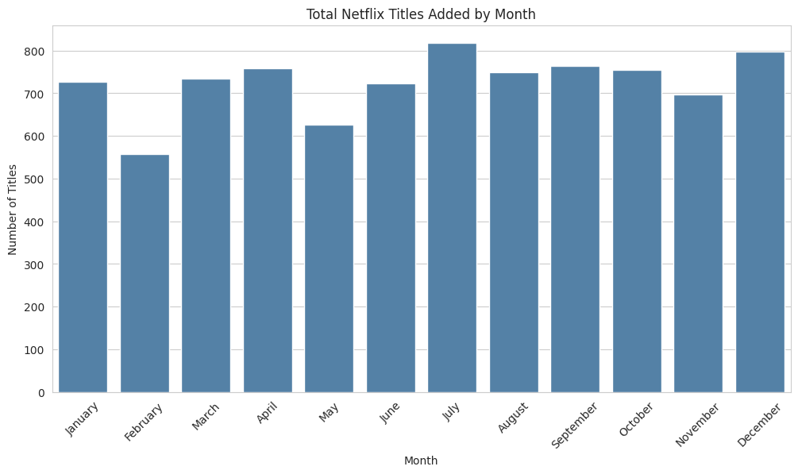
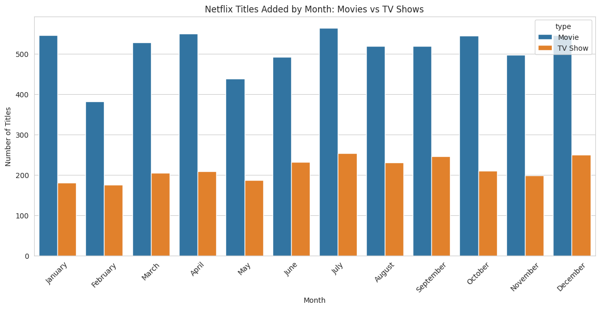
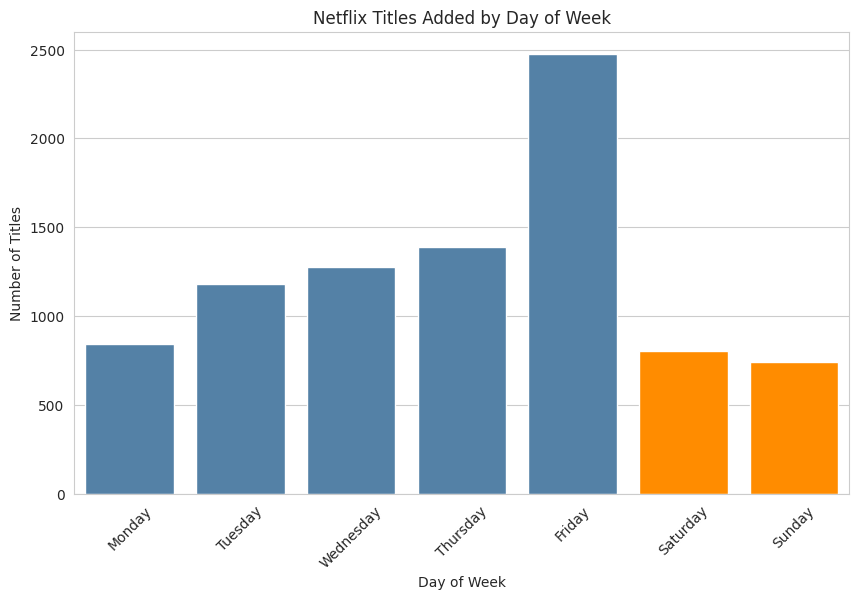
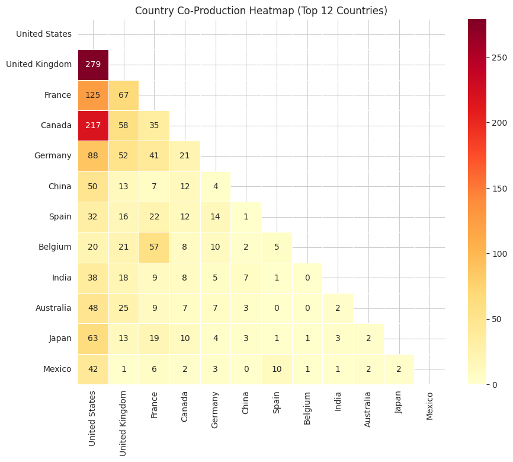
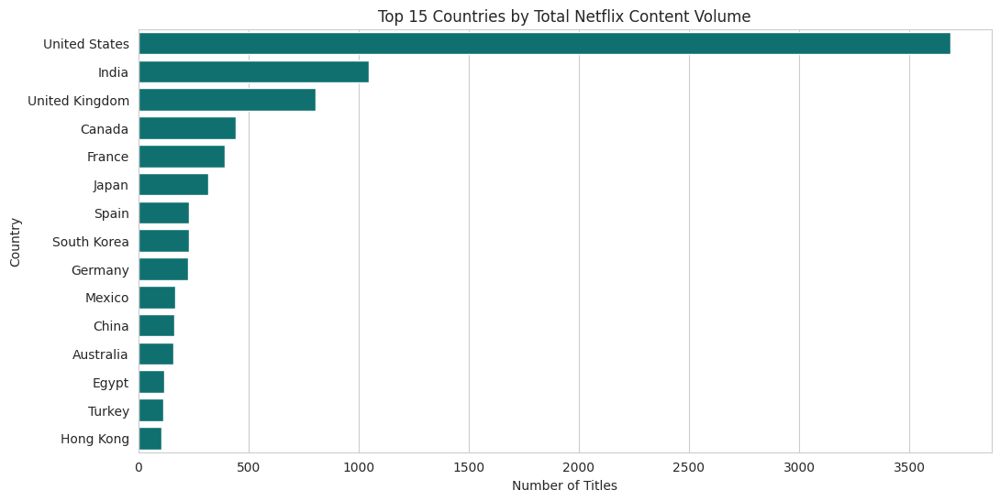
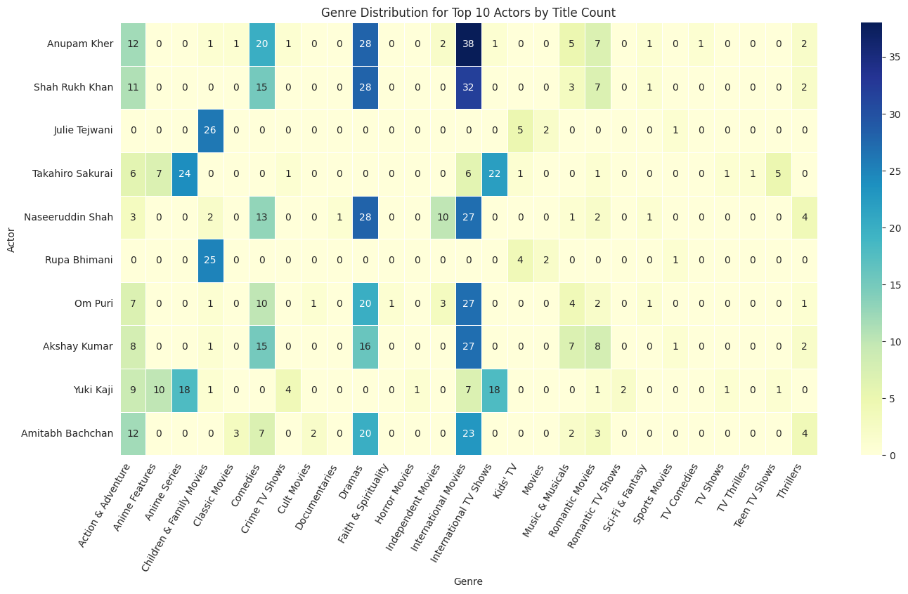
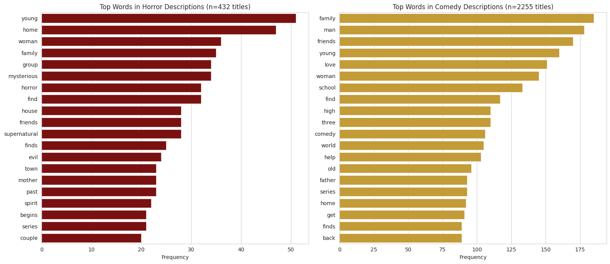

# Netflix Shows — Data Engineering & EDA

## Project Overview

This project works with the [Netflix Movies and TV Shows dataset](https://www.kaggle.com/datasets/shivamb/netflix-shows/data) from Kaggle. The dataset was loaded programmatically using `kagglehub` inside Google Colab — no manual downloads or GUI uploads were used, in line with the assignment's reproducibility requirement.

This README is organized into two parts:
- **Part 1: The Data Engineering Pipeline** — cleaning, feature engineering, and the data quality issues uncovered along the way.
- **Part 2: The Visualization Masterclass** — every chart built, the insight it revealed, and the reasoning behind key design decisions.

---

# PART 1: DATA ENGINEERING PIPELINE

## 1. The Duration Fix

### The Problem
The `duration` column in the raw dataset is a single string field that means two completely different things depending on content type:
- For Movies: something like `"90 min"`
- For TV Shows: something like `"2 Seasons"`

Mixing these into one column makes any numeric analysis (averages, distributions, comparisons) meaningless — a "duration" of `2` could mean 2 minutes or 2 seasons, and there's no way to tell without checking `type` separately every single time.

### The Approach
Rather than guessing which row was a Movie or TV Show from the `duration` string itself, the existing `type` column (which already cleanly states `"Movie"` or `"TV Show"`) was used to split the numeric value into two dedicated, type-specific columns:

```python
df['duration_num'] = df['duration'].str.extract(r'(\d+)').astype(float)

df['duration_minutes'] = np.where(df['type'] == 'Movie', df['duration_num'], np.nan)
df['duration_seasons'] = np.where(df['type'] == 'TV Show', df['duration_num'], np.nan)

df.drop(columns=['duration_num'], inplace=True)
```

### Why `NaN` and not `0`
This was a deliberate decision, not a default. A Movie doesn't have "zero seasons" — the concept of seasons simply doesn't apply to it. Using `0` would have been factually wrong and dangerous for later statistics: any `.mean()` or `.sum()` on `duration_seasons` would have silently included a flood of fake zeros from every movie in the dataset, dragging down the average and producing a misleading result. `NaN` correctly represents "not applicable," and pandas automatically excludes `NaN` from aggregate functions like `.mean()` and `.describe()` — so the stats stay honest.

`duration_num` was kept only as a temporary scratch column to extract the digits before splitting, and was dropped immediately afterward since keeping it around would have meant duplicate, unused data sitting in the dataframe — clutter that could easily get double-counted by mistake in a careless future groupby.

### A Real Data Quality Bug: The Rating/Duration Swap
After running the extraction, 3 rows came back with missing `duration` values. Rather than dropping them or assuming they were "just missing," they were investigated directly:

```python
df[df['duration'].isnull()][['title', 'type', 'duration', 'rating']]
```

This revealed a genuine data artifact in the source CSV: for these 3 titles (all Louis C.K. specials), the `rating` and `duration` values had been swapped — `rating` contained values like `"74 min"`, while `duration` was empty. This is a known quirk in this dataset, caused by a parsing misalignment somewhere upstream of the CSV.

**The fix** — a vectorized swap, done without a loop:

```python
mask = df['duration'].isnull()
df.loc[mask, ['duration', 'rating']] = df.loc[mask, ['rating', 'duration']].values
```

The `.values` part is essential here — without it, pandas tries to align the assignment by column name during the swap, which causes both columns to end up with the same value instead of actually swapping. Using `.values` strips the column labels and does a raw positional copy, which is what makes the swap work correctly in one line.

Since the true original `rating` for these 3 rows is unrecoverable, it was deliberately set to `NaN` rather than guessed — an honest "missing" is better than a fabricated value.

**Lesson learned:** always investigate *why* a value is missing before deciding how to handle it. A `NaN` can mean "truly absent" or it can mean "the value moved somewhere else due to a data error" — and those two cases require completely different fixes.

### A Notebook-State Mistake (and what it taught)
While debugging the swap, a confusing situation came up: a verification query returned a row where `duration` showed `"Movie"` and `rating` showed `"74 min"` — clearly wrong, since `type` was never part of the swap logic at all.

The cause: in Jupyter/Colab, all cells share one live, persistent `df` in memory, and cells run in the order they're *executed*, not the order they appear on the page. Re-running an old cell, or running cells out of sequence, can leave the dataframe in an inconsistent state that doesn't match what the visible code says it should be.

**The fix:** `Runtime → Restart Runtime`, followed by running every cell once, top to bottom, in the correct final order. This guarantees the dataframe's actual state matches the notebook's code exactly — not a leftover mix of old experiments.

**Lesson learned:** any cell that does `drop()`, in-place mutation, or column overwrites is effectively "single-use." Re-running it on already-modified data will either throw an error (e.g. a `KeyError` for a column already dropped) or, worse, silently corrupt the data without throwing any error at all. From this point on, every "destructive" cell was treated as a one-time operation, verified once, and never blindly re-run without a full restart.

---

## 2. Unnesting Arrays (`cast`, `director`, `country`, `listed_in`)

### The Problem
Four columns store multiple values as a single comma-separated string, e.g.:
```
country: "United States, India, France"
listed_in: "Dramas, International Movies"
```
Left in this form, accurate counting is impossible — for example, "how many titles is each actor in" can't be computed while an actor's name is buried inside a string shared with several other names.

### The Approach
For each of the four columns, a separate exploded dataframe was created — deliberately **not** overwriting the main `df`, since the original one-row-per-title structure is still needed for most other analysis. Each column got the same repeatable pattern:

```python
df_country = df[['title', 'country']].dropna(subset=['country']).copy()
df_country['country'] = df_country['country'].str.split(', ')
df_country = df_country.explode('country')
df_country['country'] = df_country['country'].str.strip()
```

The same pattern was applied to `cast`, `director`, and `listed_in`.

### Why `.copy()` Matters
Slicing a dataframe like `df[['title', 'country']]` can return a *view* rather than a guaranteed independent copy. Modifying that slice afterward can trigger a `SettingWithCopyWarning`, because pandas can't always be sure whether the original `df` or the new slice was meant to be changed. Adding `.copy()` removes that ambiguity entirely and makes the independence explicit — even on pandas versions where the warning doesn't always fire, it's worth doing as a habit rather than relying on pandas' internal guesswork.

### Why `.split(', ')` *and* `.strip()` — Not Just One
`str.split(', ')` (comma plus space) correctly handles the expected, well-formatted case. But real-world data isn't guaranteed to be perfectly consistent — a row with `"USA,India"` (no space) or `"USA,  India"` (double space) would either fail to split cleanly or leave stray whitespace. `.strip()` was added afterward as a safety net: it removes leading/trailing whitespace regardless of how the string was actually formatted, so the result stays clean even if the source data isn't perfectly uniform.

This was actually verified rather than assumed:
```python
df['country'].dropna().str.contains(',\S').sum()
```
This returned `0`, confirming the source data had no comma-without-space inconsistencies. Good to know — but `.strip()` was kept anyway as cheap insurance against any other column having different formatting quirks.

### Handling Missing Values in These Columns
Some titles have no `country`, `cast`, or `director` listed. Rather than guessing or fabricating a value, the missing rows were simply excluded *only from the column-specific exploded dataframe* used for that one type of analysis (e.g. excluded from `df_country` for country-based charts), while remaining fully intact in the main `df` for every other type of analysis (genre charts, actor charts, etc.). Dropping a row from the main dataset entirely just because one field was missing would have thrown away perfectly good data needed elsewhere.

The percentage of missing `country` values was checked explicitly before deciding this:
```python
df['country'].isnull().mean() * 100
```
This kind of percentage is documented here rather than silently ignored, since it directly affects how much of the dataset country-based visualizations actually represent.

---

## 3. Datetime Parsing (`date_added`)

### The Approach
```python
df['date_added'] = pd.to_datetime(df['date_added'], errors='coerce')

df['year_added'] = df['date_added'].dt.year
df['month_added'] = df['date_added'].dt.month
df['day_added'] = df['date_added'].dt.day_name()
```

`errors='coerce'` was used deliberately: it tells pandas that any value it can't parse as a valid date should become `NaT` (datetime's version of `NaN`) instead of crashing the entire conversion. Without it, a single malformed date string anywhere in 8,000+ rows would have broken the whole pipeline.

### Investigating the Missing Dates
After parsing, 98 rows came back with a missing `date_added`. Rather than assuming this was either "obviously fine" or "obviously a bug," it was investigated directly by checking what the *original, unparsed* string actually looked like for those specific rows:

```python
mask = df['date_added'].isnull()
df[mask]['date_added'].unique()[:20]
```

This returned a single result: `array([nan], dtype=object)` — meaning every one of these 98 rows was genuinely blank in the original source CSV, with no inconsistent formatting or recoverable value hiding underneath. This was a clean, confirmed case of true missing data, not a parsing failure caused by a date format pandas didn't understand.

**Why this check mattered:** a missing-date count alone doesn't tell you *why* the dates are missing. It could mean "blank in the source" (nothing to do) or "a date existed but in an unparseable format" (something to fix). Confirming which one it was — by going back to the raw string before any parsing was applied — turned an assumption into a verified fact.

These 98 rows keep `NaT` across `date_added`, `year_added`, `month_added`, and `day_added`, and will be excluded from any time-based visualizations in Part 2, since there's no honest way to plot a date that was never recorded.

---

## Summary of Key Decisions & Lessons

| Issue | Decision Made | Why |
|---|---|---|
| Movie vs. TV Show duration mixed in one column | Split into `duration_minutes` and `duration_seasons` using `type` | One column meaning two different things makes numeric analysis meaningless |
| Non-applicable duration values | Filled with `NaN`, not `0` | `0` would silently corrupt averages and sums; `NaN` is correctly excluded from aggregates |
| 3 rows with swapped `rating`/`duration` values | Vectorized `.loc` swap using `.values` | A real upstream data bug, not a missing-value case — fixed at the source rather than worked around |
| Unrecoverable original `rating` for swapped rows | Set to `NaN` | Honest about not knowing, rather than guessing a value |
| Notebook state corruption from re-running destructive cells | Restart Runtime + run all cells once, in order | Jupyter/Colab share one live `df` across cells regardless of page order; re-running drop/mutation cells silently corrupts state |
| Comma-separated multi-value columns | Exploded into separate dataframes, main `df` left untouched | Original one-row-per-title structure still needed for most other analysis |
| Possible whitespace inconsistency after splitting | Used `.split(', ')` + `.strip()` together, verified assumption with a direct check | Don't trust source data formatting blindly, even when split appears to work |
| Missing values in `country`/`cast`/`director` | Dropped only from the relevant exploded dataframe, kept in main `df` | Avoids fabricating data while not discarding rows useful elsewhere |
| 98 missing `date_added` values | Verified against raw pre-parse strings before deciding how to treat them | Confirmed genuine missing data rather than a parsing failure — different problems need different fixes |

The overarching theme across all of Part 1: every fix was made only after directly inspecting the actual rows involved, rather than assuming what a `NaN` or an error meant. Several "obvious" first guesses turned out to be incomplete or wrong once actually checked against the data — which is exactly the kind of discipline this assignment was designed to build before any visualization work begins.

---

*Part 2 (Visualizations) will be documented separately once the visualization pipeline is complete.*


---

# PART 2: VISUALIZATION MASTERCLASS

## Theme 1: Temporal Trends

### Chart 1.1 — Movies vs TV Shows Added Per Year (Line Chart)

**Code approach:**
```python
trend = df.dropna(subset=['year_added']).groupby(['year_added', 'type']).size().reset_index(name='count')

plt.figure(figsize=(12,6))
sns.lineplot(data=trend, x='year_added', y='count', hue='type', marker='o')
plt.title('Netflix Content Added Per Year: Movies vs TV Shows')
plt.xlabel('Year Added')
plt.ylabel('Number of Titles')
plt.show()
```



**Insight:**
Both Movies and TV Shows stay near-flat in volume until around 2015, after which both grow sharply — but Movies grow much faster than TV Shows. Movies peak around 2019 at roughly 1,400 titles added in a single year, while TV Shows peak lower, around 600. This shows Netflix's catalog growth during this period was disproportionately movie-heavy rather than balanced between the two content types.

**Caveats:**
The apparent decline in 2020-2021 should not be read at face value as a "COVID slowdown" without qualification. The dataset's `date_added` values only run through **September 2021**, meaning the 2021 data point reflects 9 months, not a full 12 — so part of the visible drop is a data-completeness artifact, not necessarily a real-world trend. A genuine COVID-related slowdown starting in 2020 is plausible and consistent with known industry production delays, but this chart alone cannot isolate that effect from the missing months of 2021 data. This was confirmed by checking which months were present in the 2021 subset:
```python
df[df['year_added'] == 2021]['date_added'].dt.month.value_counts().sort_index()
```
which showed data only up to September.

---

### Chart 1.2 — Most Popular Months for New Releases (Two Approaches Compared)

**Approach A — Combined total by month:**
```python
month_order = ['January','February','March','April','May','June',
               'July','August','September','October','November','December']

df['month_name'] = df['date_added'].dt.month_name()

monthly_counts = df.dropna(subset=['month_name'])['month_name'].value_counts().reindex(month_order)

plt.figure(figsize=(12,6))
sns.barplot(x=monthly_counts.index, y=monthly_counts.values, color='steelblue')
plt.title('Total Netflix Titles Added by Month')
plt.xlabel('Month')
plt.ylabel('Number of Titles')
plt.xticks(rotation=45)
plt.show()
```



**Approach B — Split by type (Movie vs TV Show), grouped bars:**
```python
monthly_by_type = df.dropna(subset=['month_name']).groupby(['month_name','type']).size().reset_index(name='count')
monthly_by_type['month_name'] = pd.Categorical(monthly_by_type['month_name'], categories=month_order, ordered=True)
monthly_by_type = monthly_by_type.sort_values('month_name')

plt.figure(figsize=(14,6))
sns.barplot(data=monthly_by_type, x='month_name', y='count', hue='type')
plt.title('Netflix Titles Added by Month: Movies vs TV Shows')
plt.xlabel('Month')
plt.ylabel('Number of Titles')
plt.xticks(rotation=45)
plt.show()
```



**Insight:**
The busiest months for adding new content are **July and December**, while **February and May** are consistently the quietest, with a smaller dip also visible in June. This pattern holds true for both Movies and TV Shows individually (Approach B) — there is no month where one content type spikes while the other drops; both move up and down together across the year. This suggests Netflix does not appear to schedule Movie releases and TV Show releases on different seasonal calendars — both follow the same broad release rhythm.

**Why both approaches were built, and why Approach A was kept as the final chart:**
Approach A (combined monthly total) is the cleaner, less cluttered chart, and it answers "which months are most popular" directly. However, Approach A alone could not have ruled out the possibility that the combined total was being driven by only one content type — for example, the July peak could in theory have come entirely from TV Shows with Movies actually flat that month, and the combined bar would hide that completely. Approach B was necessary as a diagnostic step to confirm that Movies and TV Shows move together month-to-month. Only after confirming this with Approach B was Approach A considered a safe, sufficient summary chart to use as the final visualization. This is a deliberate example of choosing a simpler chart only after verifying that simplicity doesn't lose information — not simply picking the cleaner-looking option by default.

**Caveats:**
Same `date_added` completeness caveat as Chart 1.1 applies here — the 2021 data only runs through September, though since this chart aggregates across all years by month rather than by year, the effect of a partial 2021 is diluted across 13+ years of data and is unlikely to meaningfully distort which months rank highest or lowest.

---

### Chart 1.3 — Weekday vs Weekend Release Pattern

**Code approach:**
```python
day_order = ['Monday','Tuesday','Wednesday','Thursday','Friday','Saturday','Sunday']

df['day_added'] = df['date_added'].dt.day_name()
day_counts = df.dropna(subset=['day_added'])['day_added'].value_counts().reindex(day_order)

plt.figure(figsize=(10,6))
ax = sns.barplot(x=day_counts.index, y=day_counts.values, color='steelblue')

for i, day in enumerate(day_order):
    if day in ['Saturday', 'Sunday']:
        ax.patches[i].set_facecolor('darkorange')

plt.title('Netflix Titles Added by Day of Week')
plt.xlabel('Day of Week')
plt.ylabel('Number of Titles')
plt.xticks(rotation=45)
plt.show()

weekend_total = day_counts[['Saturday','Sunday']].sum()
weekday_total = day_counts[['Monday','Tuesday','Wednesday','Thursday','Friday']].sum()
print("Weekend avg per day:", weekend_total/2)
print("Weekday avg per day:", weekday_total/5)
```



**Insight:**
The initial hypothesis going into this chart was that weekends would show a release-day bump. The data shows the opposite: **Saturday and Sunday are the two quietest days of the week** for new additions (~772 titles/day on average), while **weekdays average nearly double that (~1,433 titles/day)**. The single biggest standout is **Friday**, which is by far the highest bar of the week — more than double Thursday and far above Monday. This is a release-strategy pattern, not a random fluctuation: content is most likely added on Friday so it's already fresh and available right as the weekend viewing window begins, rather than being added during the weekend itself.

**Why this is worth documenting carefully:**
The first read of this chart could easily have been mistaken for confirming the original "weekend bump" hypothesis, since Friday — the day before the weekend — is the peak. But Friday itself is categorized as a weekday here, and the actual weekend days (Saturday, Sunday) are the lowest, not the highest, bars on the chart. This was caught by checking the exact numeric averages rather than relying on a first visual impression, and it's a good example of why a hypothesis should be checked precisely against what the chart shows rather than against what was expected.

**Caveats / debugging note:**
This chart also surfaced a real bug worth recording: `day_added` had originally been created using `.dt.day` (day-of-month, 1–31) instead of `.dt.day_name()` (weekday name) — likely an old artifact from an earlier Part 1 cell. This produced numeric values that silently failed to match the `day_order` weekday strings, leaving the column full of `NaN` after `.reindex()` without throwing any error. It was only caught by inspecting `df['day_added'].unique()` directly and noticing the values were numbers, not day names. Fixed via `df['day_added'] = df['date_added'].dt.day_name()`. This is the same category of issue as the notebook-state bugs from Part 1 — a column silently holding the wrong data, only visible by checking actual contents rather than trusting that a chart's emptiness or strangeness must be a plotting issue.

---

## Theme 2: Network & Geospatial Analysis

### Chart 2.1 — Country Co-Production Heatmap (Top 12 Countries)

**Code approach:**
```python
from itertools import combinations
import numpy as np

multi_country = df[['title','country']].dropna(subset=['country']).copy()
multi_country['country_list'] = multi_country['country'].str.split(', ').apply(lambda x: [c.strip() for c in x])
multi_country = multi_country[multi_country['country_list'].apply(len) > 1]

top_countries = (
    multi_country['country_list']
    .explode()
    .value_counts()
    .head(12)
    .index.tolist()
)

matrix = pd.DataFrame(0, index=top_countries, columns=top_countries)

for countries in multi_country['country_list']:
    relevant = [c for c in set(countries) if c in top_countries]
    for a, b in combinations(sorted(relevant), 2):
        matrix.loc[a, b] += 1
        matrix.loc[b, a] += 1

mask = np.triu(np.ones_like(matrix, dtype=bool))

plt.figure(figsize=(10,8))
sns.heatmap(matrix, annot=True, fmt='d', cmap='YlOrRd', linewidths=0.5, mask=mask)
plt.title('Country Co-Production Heatmap (Top 12 Countries)')
plt.show()
```



**Insight:**
**United Kingdom–United States** is by far the strongest co-production relationship in the dataset, with 279 shared titles — nearly 30% higher than the next strongest pair, **Canada–United States** (217). Beyond these two, collaboration is dominated by Western, English-speaking, and major film-industry countries paired with the US (France, Germany, Japan, Australia, Mexico, China, India), confirming the US acts as the central hub of international co-production in this dataset. One regional cluster stands out outside the US-centric pattern: **Belgium–France** (57), suggesting a distinct, more regional (rather than US-anchored) European production relationship.

**Why a heatmap over a network graph:**
The brief suggested either a network graph or a heatmap. A network graph was considered but rejected — with only a handful of strongly-weighted pairs and a long tail of one-off collaborations across many other countries, a network graph would either get visually cluttered with dozens of barely-connected nodes, or require aggressive pruning that risks hiding genuine but smaller relationships. Restricting to the **top 12 countries by overall content volume** and showing their pairwise relationship as a heatmap kept the chart dense with information while remaining fully readable.

**Design decision — masking the upper triangle:**
Country collaboration is inherently a mutual, undirected relationship — "UK collaborated with USA" and "USA collaborated with UK" describe the exact same fact, so the underlying matrix is symmetric across its diagonal by construction (this is the same property a correlation matrix has). The first version of this chart displayed the full symmetric matrix, which meant every pair's value appeared twice (e.g. both the UK row/USA column cell and the USA row/UK column cell showed `279`) along with a meaningless all-zero diagonal (a country doesn't co-produce with itself). This redundancy was removed by masking the upper triangle with `np.triu()`, so each country pair is shown exactly once. This isn't just a cosmetic choice — it directly reflects the symmetric, undirected nature of the underlying relationship being measured, rather than an artifact of how the matrix happened to be built.

**Caveats:**
This analysis only considers titles with **2 or more** listed countries — titles with a single country by definition can't represent a collaboration and were excluded before building the pairs. Also, the `country` field is missing for a meaningful portion of titles (see Part 1 README for the exact percentage); any collaborations among those titles are simply unknowable and not represented here.

---

### Chart 2.2 — Top 15 Countries by Total Content Volume

**Code approach:**
```python
country_totals = (
    df[['title','country']]
    .dropna(subset=['country'])
    .assign(country=lambda d: d['country'].str.split(', '))
    .explode('country')
)
country_totals['country'] = country_totals['country'].str.strip()

top15 = country_totals['country'].value_counts().head(15)

plt.figure(figsize=(12,6))
sns.barplot(x=top15.values, y=top15.index, color='teal')
plt.title('Top 15 Countries by Total Netflix Content Volume')
plt.xlabel('Number of Titles')
plt.ylabel('Country')
plt.show()
```



**Insight:**
The **United States dominates total content volume by a huge margin** — roughly 3,700 titles, nearly 3.5x the next country. **India is a clear second** at just over 1,000 titles, ahead of the United Kingdom (~800). The rest of the top 15 drops off steadily through Canada, France, Japan, Spain, South Korea, and Germany, down to Egypt, Turkey, and Hong Kong near the bottom of the top 15.

**A cross-chart insight worth highlighting:** comparing this chart against the Chart 2.1 collaboration heatmap reveals an interesting contrast. India ranks **#2 in total volume** but barely registers in the collaboration heatmap (only 38 shared titles with the US, and no meaningful presence with any other major country). This suggests India's high content volume is overwhelmingly **domestic, solo-country production** rather than international co-production — a very different pattern from, say, the UK or Canada, whose volume and collaboration rankings are both consistently high. This kind of insight only became visible by deliberately comparing two separate charts against each other, rather than reading each one in isolation.

**Methodology note:** this chart counts every title once **per country listed**, not once per title overall. A US-UK co-produced title contributes +1 to both the US and UK totals. This is the correct approach for measuring a country's "involvement volume," but it does mean these totals are not mutually exclusive and shouldn't be summed across countries to reconstruct the total dataset size.

**Caveats:**
Same missing-`country` limitation as Chart 2.1 applies — titles without a listed country are excluded from this ranking entirely, so these are volumes among titles with known country data only, not the full catalog.

---

## Theme 3: Actor/Director Analytics

### Chart 3.1 — Most Frequent Actor-Director Duos

**Code approach:**
```python
ad = df[['title','cast','director']].dropna(subset=['cast','director']).copy()
ad['cast_list'] = ad['cast'].str.split(', ').apply(lambda x: [c.strip() for c in x])
ad['director_list'] = ad['director'].str.split(', ').apply(lambda x: [d.strip() for d in x])

duos = []
for _, row in ad.iterrows():
    for actor in row['cast_list']:
        for director in row['director_list']:
            duos.append((actor, director))

duo_counts = pd.Series(duos).value_counts().head(15)
print(duo_counts)
```

**Insight:**
The top 15 duo list is dominated by two very different patterns, which only became clear after looking past the raw counts and checking who these people actually are:

1. **Rajiv Chilaka** appears in 7 of the top entries, each time paired with a *different* voice actor (Julie Tejwani, Rajesh Kava, Rupa Bhimani, Jigna Bhardwaj, Vatsal Dubey, Swapnil, Mousam), each at 13-19 occurrences. Verifying directly against his titles confirmed this is entirely **animated content** — a single director/creator working repeatedly with a recurring voice-acting ensemble across many episodes of the same show(s), rather than a true one-on-one creative collaboration.
2. **S.S. Rajamouli**, by contrast, shows a genuinely different pattern: paired with named lead actors (Prabhas, Rana Daggubati, Anushka Shetty, Ramya Krishnan), each at 7 occurrences — consistent with a feature-film director reusing the same lead cast across major Telugu-language films.

**Why this distinction matters:** the raw "duo count" ranking alone treats both patterns identically, but they represent fundamentally different things — a director's recurring **voice-cast ensemble** for a single animated franchise versus a director's recurring **lead-actor collaboration** across distinct feature films. Reporting only the numbers without checking the underlying titles would have produced a misleading "top duos" list that conflates these two very different phenomena. This was caught by explicitly inspecting the actual titles behind the top result:
```python
df[df['director'] == 'Rajiv Chilaka'][['title','type']].drop_duplicates()
```

**Caveats:**
This analysis only considers titles where **both** `cast` and `director` are present — titles missing either field are excluded entirely, since a duo can't be identified without both. Duo counts also scale with how many actors/directors are listed per title — a title with 3 directors and 5 actors contributes 15 duo pairs from a single title, so high-cast-count titles (especially ensemble animated shows) can inflate duo counts relative to titles with a small, fixed cast — which is exactly the mechanism behind the Rajiv Chilaka cluster above.

---

### Chart 3.2 — Genre Distribution for Top 10 Actors

**Code approach:**
```python
top_actors = df_cast['cast'].value_counts().head(10)
top_actor_names = top_actors.index.tolist()

actor_genre = df_cast[df_cast['cast'].isin(top_actor_names)][['title','cast']].merge(
    df[['title','listed_in']], on='title', how='left'
)
actor_genre = actor_genre.dropna(subset=['listed_in']).copy()
actor_genre['listed_in'] = actor_genre['listed_in'].str.split(', ').apply(lambda x: [g.strip() for g in x])
actor_genre = actor_genre.explode('listed_in')

genre_matrix = actor_genre.groupby(['cast','listed_in']).size().unstack(fill_value=0)
genre_matrix = genre_matrix.loc[top_actor_names]

plt.figure(figsize=(16,8))
sns.heatmap(genre_matrix, annot=True, fmt='d', cmap='YlGnBu', linewidths=0.5)
plt.title('Genre Distribution for Top 10 Actors by Title Count')
plt.xlabel('Genre')
plt.ylabel('Actor')
plt.xticks(rotation=60, ha='right')
plt.show()
```



**Insight:**
The top 10 actors by title count split into **three distinct clusters** by genre fingerprint, rather than each actor having an individually unique pattern:

1. **Mainstream Bollywood leads** (Anupam Kher, Shah Rukh Khan, Naseeruddin Shah, Om Puri, Akshay Kumar, Amitabh Bachchan) — all six converge on the **same two dominant genres**: International Movies (20-38 titles each) and Dramas (16-28 each), typically with a secondary bump in Comedies. This is a structural finding rather than six separate stories: it suggests "International Movies" and "Dramas" function as broad umbrella tags for mainstream Hindi-language cinema in this dataset's genre-tagging system, rather than reflecting each actor's individually distinct genre identity.
2. **Japanese voice actors** (Takahiro Sakurai, Yuki Kaji) — concentrated almost entirely in Anime Series and International TV Shows, with near-zero presence elsewhere, confirming they are anime-specific voice talent.
3. **Children's-content voice actors** (Julie Tejwani, Rupa Bhimani) — concentrated almost entirely in Children & Family Movies (25-26 titles) with a secondary presence in Kids' TV. These are the same names seen in the Chart 3.1 actor-director duo analysis as part of director Rajiv Chilaka's recurring animated-ensemble cast, and this chart confirms their genre profile is consistent with that — a single animated-franchise voice cast, not general-purpose actors.

**Why this framing matters:** a first read of this heatmap could describe it as "each actor is dominant in their own genre," but a closer look shows that's not quite accurate — most of the dominance is *shared* across a group of actors with the same fingerprint, not unique to any one of them. Naming the three clusters explicitly is a more precise and useful insight than describing each row independently.

**Caveats:**
A title can carry multiple genre tags simultaneously (e.g. both "Dramas" and "International Movies"), so row totals across genres for a given actor will exceed their total title count — this is expected and correct, not double-counting in the row-count of titles, but a reflection of overlapping genre labels in the source data.

---

## Theme 4: Text & Genre Analysis

### Chart 4.1 — Most Common Genre Combinations

**Code approach:**
```python
from itertools import combinations

genre_combo = df[['title','listed_in']].dropna(subset=['listed_in']).copy()
genre_combo['genre_list'] = genre_combo['listed_in'].str.split(', ').apply(lambda x: [g.strip() for g in x])

combo_pairs = []
for genres in genre_combo['genre_list']:
    for pair in combinations(sorted(set(genres)), 2):
        combo_pairs.append(pair)

combo_counts = pd.Series(combo_pairs).value_counts().head(15)
print(combo_counts)
```

**Insight:**
The single most common genre combination, **Dramas + International Movies (1,483 titles)**, is not just the top result — it's nearly **double** the second-place combination (Comedies + International Movies, 804), making it a clearly dominant pairing rather than a marginal lead. More strikingly, **9 of the top 15 genre combinations include either "International Movies" or "International TV Shows."**

This pattern was investigated rather than taken at face value. The hypothesis: "International Movies"/"International TV Shows" may function less as a specific genre and more as a **broad non-US-production marker**, layered on top of a title's actual genre (Drama, Comedy, Action, etc.). This was tested directly:
```python
df[df['listed_in'].str.contains('International Movies', na=False)]['country'].dropna().str.contains('United States').value_counts()
```
The result confirmed it: of titles tagged "International Movies" with known country data, only **166 (≈7%)** are US-produced, while **2,377 (≈93%)** are not. This strongly supports the interpretation that "International Movies"/"International TV Shows" act as a near-universal companion tag for non-US content, which is why it appears paired with so many different core genres rather than standing as its own distinct category.

**Connection to earlier findings:** this also explains a pattern first noticed in Chart 3.2 (Genre Distribution for Top 10 Actors), where International Movies appeared as a dominant genre across all six Bollywood actors analyzed — those actors' titles are non-US (Indian) productions, so the "International Movies" tag was being applied consistently regardless of each title's actual core genre. Recognizing this connection across two separate charts gives a more complete explanation than either chart would on its own.

**Caveats:**
This analysis only considers titles with `listed_in` present (very few titles are missing this field, unlike `country` or `director`). Combination counts only consider 2-genre pairs — titles with 3+ genres contribute multiple pairs, the same mechanism seen in the country co-production analysis, so a title with many genre tags contributes more total pairs than a title with only one or two.

---

### Chart 4.2 — Most Frequent Words in Descriptions: Horror vs Comedy

**Code approach:**
```python
import re
from collections import Counter

horror = df[df['listed_in'].str.contains('Horror', na=False)]['description']
comedy = df[df['listed_in'].str.contains('Comedies', na=False)]['description']

stopwords = set([
    'the','a','an','and','or','of','to','in','is','it','this','that','with',
    'for','on','as','by','at','his','her','their','from','but','are',
    'be','has','have','was','were','he','she','they','its','who','when',
    'after','into','out','about','more','can','will','one','two','new',
    'life','up','not','all','him','what','than','then','where','while',
    'must','only','them'
])

def get_word_counts(text_series, top_n=20):
    text = ' '.join(text_series.dropna()).lower()
    words = re.findall(r'\b[a-z]+\b', text)
    words = [w for w in words if w not in stopwords and len(w) > 2]
    return Counter(words).most_common(top_n)

horror_words = get_word_counts(horror)
comedy_words = get_word_counts(comedy)

fig, axes = plt.subplots(1, 2, figsize=(16,7))

h_words, h_counts = zip(*horror_words)
sns.barplot(x=list(h_counts), y=list(h_words), color='darkred', ax=axes[0])
axes[0].set_title(f'Top Words in Horror Descriptions (n={len(horror)} titles)')
axes[0].set_xlabel('Frequency')

c_words, c_counts = zip(*comedy_words)
sns.barplot(x=list(c_counts), y=list(c_words), color='goldenrod', ax=axes[1])
axes[1].set_title(f'Top Words in Comedy Descriptions (n={len(comedy)} titles)')
axes[1].set_xlabel('Frequency')

plt.tight_layout()
plt.show()
```



**Insight:**
After filtering out common stopwords, the two genres show a mix of shared generic vocabulary and genuinely genre-distinctive words.

**Shared, non-distinctive words** appearing prominently in both lists — "young," "home," "family," "find/finds," "friends," "woman," "series" — are generic narrative-description vocabulary that doesn't actually distinguish one genre from the other, despite surviving the stopword filter.

**Genuinely Horror-distinctive words:** "mysterious," "supernatural," "evil," "spirit," "house," "town," "couple" — these point to a consistent thematic signature of isolated settings (house, town) combined with supernatural or ambiguous threat (evil, spirit, supernatural, mysterious). Notably, "horror" itself appears 32 times, since the genre name is often used directly within its own synopses.

**Genuinely Comedy-distinctive words:** "love," "school," "high" (likely part of "high school"), "father," "help" — pointing toward relationship-driven and coming-of-age/everyday settings, a clear contrast to Horror's isolation-and-threat vocabulary.

**Why this is framed as a lightweight, descriptive finding rather than deep insight:** word-frequency counts on short synopsis text can only reveal surface-level vocabulary patterns, not plot structure, tone, or narrative depth. The genuine value of this chart is as a **sanity check** that the genre labels in this dataset correspond to measurably different descriptive language — i.e., the genre tagging is meaningful and not arbitrary — rather than as a deep textual analysis of either genre.

**Caveats:**
Comedy has **2,255** titles in this dataset compared to Horror's **432** — over 5x more. This means raw frequency counts are not directly comparable between the two lists (e.g. "family" appearing 185 times in Comedy vs 35 times in Horror is roughly proportional to the underlying title-count difference, not necessarily a 5x stronger thematic association). The stopword list used is a manually curated, non-exhaustive set — sufficient to remove the most common filler words for this comparison, but not a substitute for a full NLP-grade stopword corpus.

---

*(End of Part 2 visualizations)*

